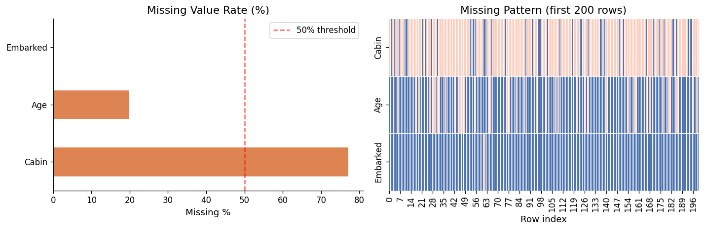
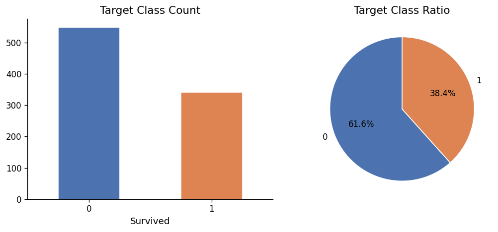
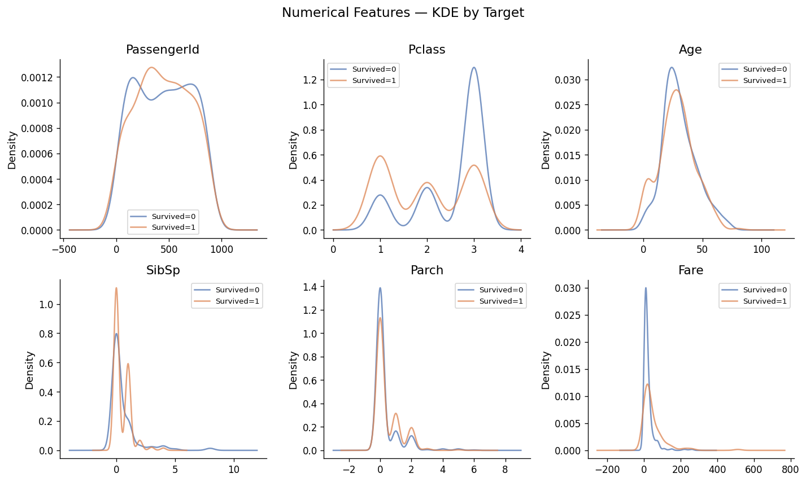
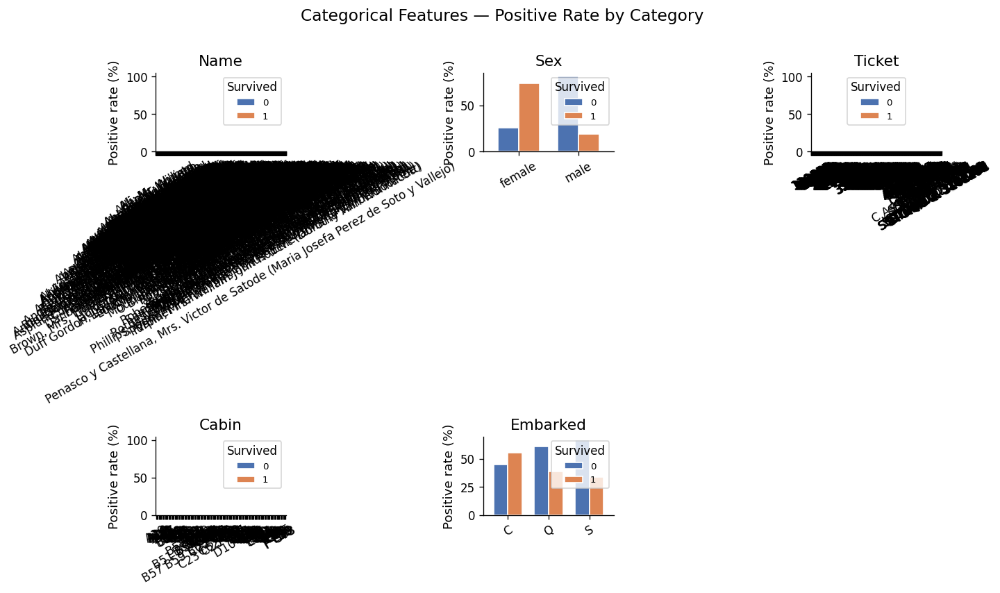
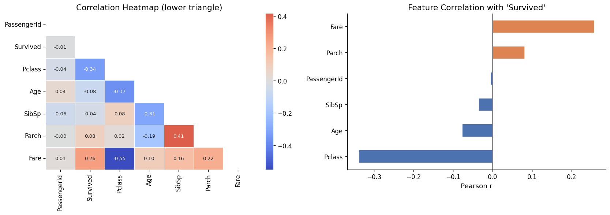
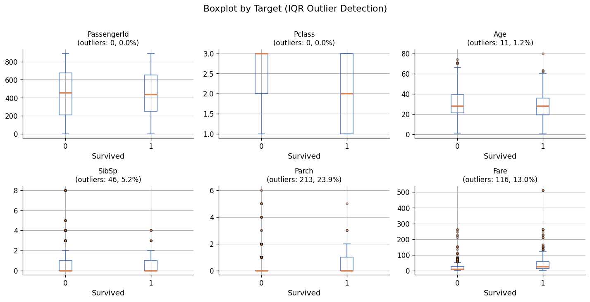

# EDA Report — `Survived` 이진 분류
*생성일시: 2026-05-29 06:12*

---
## 1. 데이터 개요
- Shape: **891 rows × 12 cols**
- 수치형: ['PassengerId', 'Pclass', 'Age', 'SibSp', 'Parch', 'Fare']
- 범주형: ['Name', 'Sex', 'Ticket', 'Cabin', 'Embarked']

## 2. 결측치
| 컬럼 | 결측률(%) |
|---|---|
| Cabin | 77.1 |
| Age | 19.9 |
| Embarked | 0.2 |

## 3. 타겟 불균형
- 소수:다수 비율: **0.623**
- 분포: {0: 549, 1: 342}

## 4–6. 시각화

## 7. 전처리 주의사항
- **결측치 50%+** 컬럼 삭제 검토: `['Cabin']`
- **결측치 ≤20%** 중앙값/최빈값 대체: `['Age', 'Embarked']`
- **이상치 10%+** 로그변환/Winsorizing: `['Parch', 'Fare']`
- **이상치 2~10%** RobustScaler/clip: `['SibSp']`
- **고왜도 피처** 로그/박스콕스 변환: `['SibSp(skew=3.70)', 'Parch(skew=2.75)', 'Fare(skew=4.79)']`
- **고카디널리티** 범주형 → Target Encoding / 임베딩: `['Name', 'Ticket', 'Cabin']`

---
*Generated by Kaggle EDA Agent*