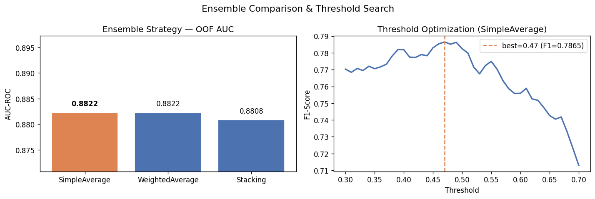
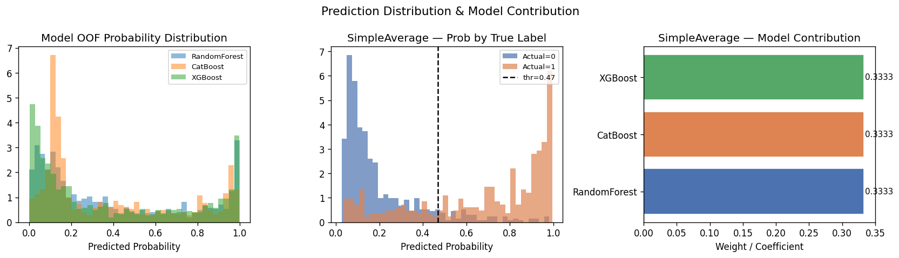

# Ensemble & Submission Report
*생성일시: 2026-05-29 07:48*

---
## 개별 모델 OOF AUC
| 모델 | AUC |
|---|---|
| RandomForest | 0.8769 |
| XGBoost | 0.8765 |
| CatBoost | 0.8752 |

## 앙상블 전략 비교
| 전략 | OOF AUC | 가중치 |
|---|---|---|
| SimpleAverage ✅ | 0.8822 | RandomForest:0.333 / CatBoost:0.333 / XGBoost:0.333 |
| WeightedAverage | 0.8822 | RandomForest:0.336 / CatBoost:0.330 / XGBoost:0.334 |
| Stacking | 0.8808 | RandomForest:0.442 / CatBoost:1.082 / XGBoost:0.456 |

## 최종 설정
- **최고 앙상블**: SimpleAverage
- **최적 Threshold**: 0.47
- **최종 CV AUC**: 0.8822

## 시각화

---
*Generated by Kaggle Ensemble Agent*