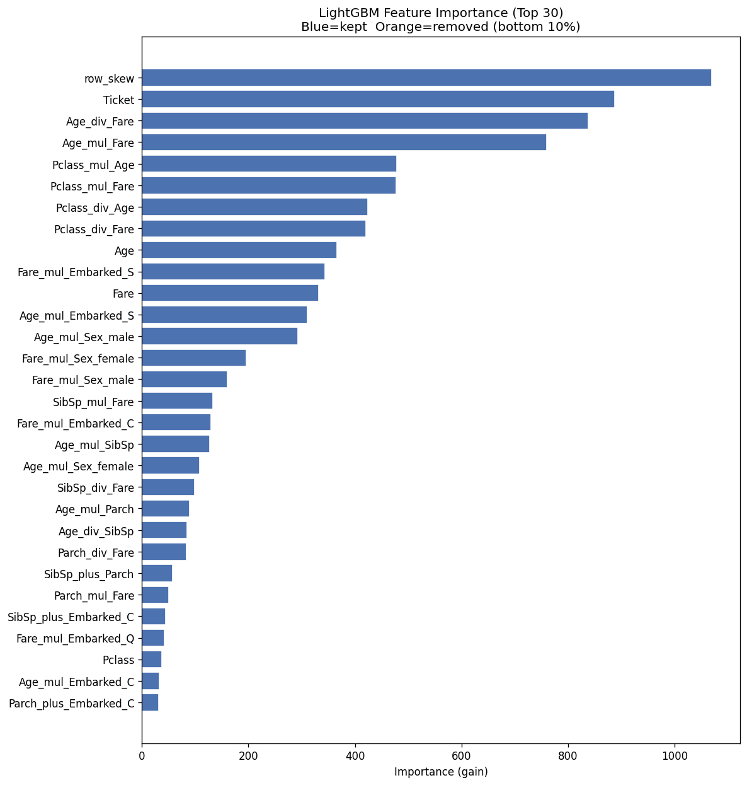
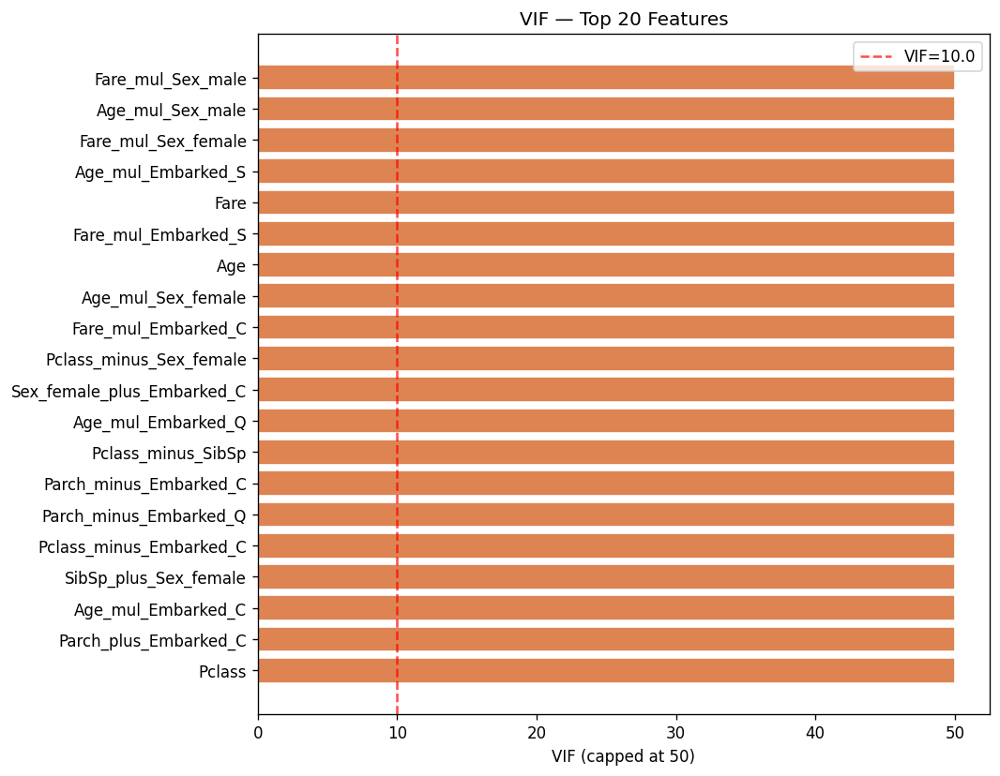
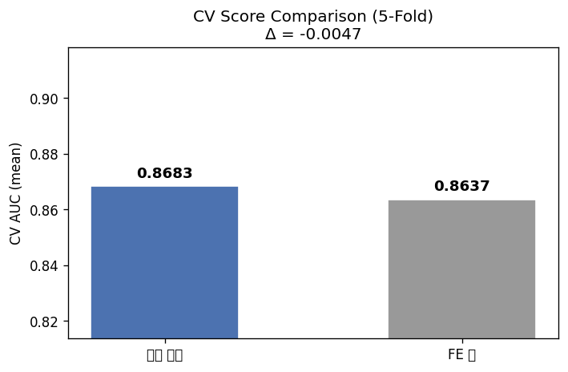

# Feature Engineering Report
*생성일시: 2026-05-29 06:53*

---
## 요약
| 항목 | 값 |
|---|---|
| 원본 피처 수 | 11 |
| 최종 피처 수 | 89 |
| 고상관 제거 | 138 |
| 낮은 중요도 제거 | 10 |
| CV AUC (원본) | 0.8683 |
| CV AUC (FE 후) | 0.8637 |
| AUC 변화 | -0.0047 |

## 선택된 피처
```
row_skew
Ticket
Age_div_Fare
Age_mul_Fare
Pclass_mul_Age
Pclass_mul_Fare
Pclass_div_Age
Pclass_div_Fare
Age
Fare_mul_Embarked_S
Fare
Age_mul_Embarked_S
Age_mul_Sex_male
Fare_mul_Sex_female
Fare_mul_Sex_male
SibSp_mul_Fare
Fare_mul_Embarked_C
Age_mul_SibSp
Age_mul_Sex_female
SibSp_div_Fare
Age_mul_Parch
Age_div_SibSp
Parch_div_Fare
SibSp_plus_Parch
Parch_mul_Fare
SibSp_plus_Embarked_C
Fare_mul_Embarked_Q
Pclass
Age_mul_Embarked_C
Parch_plus_Embarked_C
Age_div_Parch
Pclass_minus_Embarked_C
SibSp_plus_Sex_female
Pclass_mul_Embarked_S
Pclass_minus_SibSp
Age_mul_Embarked_Q
Parch_minus_Embarked_C
Parch_minus_Embarked_Q
Sex_female_plus_Embarked_C
SibSp_mul_Parch
SibSp_minus_Embarked_C
Pclass_minus_Embarked_Q
Pclass_minus_Sex_female
Pclass_plus_SibSp
Parch_minus_Sex_female
Pclass_div_SibSp
Parch_plus_Embarked_Q
Pclass_plus_Parch
SibSp_mul_Embarked_S
Parch_plus_Sex_female
SibSp_minus_Sex_female
SibSp_minus_Parch
Pclass_plus_Embarked_C
Sex_female_plus_Embarked_Q
Sex_female_plus_Embarked_S
Pclass_minus_Parch
SibSp_div_Parch
Parch_mul_Embarked_S
Sex_male_mul_Embarked_Q
Sex_female
Parch
Pclass_mul_Sex_male
Pclass_mul_Embarked_C
Pclass_mul_Sex_female
Sex_female_minus_Embarked_S
Pclass_div_Parch
Pclass_plus_Sex_female
Sex_female_minus_Embarked_Q
Parch_mul_Sex_male
Parch_mul_Embarked_C
Embarked_S
SibSp
Embarked_Q
Embarked_C
Pclass_mul_Parch
Sex_male_mul_Embarked_S
Sex_female_minus_Embarked_C
Parch_mul_Sex_female
SibSp_mul_Sex_male
SibSp_mul_Sex_female
SibSp_mul_Embarked_C
SibSp_mul_Embarked_Q
Sex_female_plus_Sex_male
Sex_female_mul_Embarked_Q
Sex_female_mul_Embarked_C
Sex_female_div_Sex_male
Sex_female_mul_Sex_male
Parch_mul_Embarked_Q
Sex_male_mul_Embarked_C
```

## 시각화




---
*Generated by Kaggle Feature Engineering Agent*